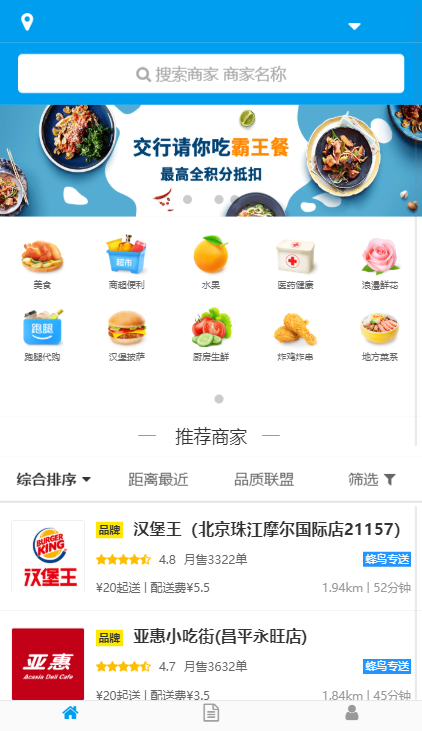
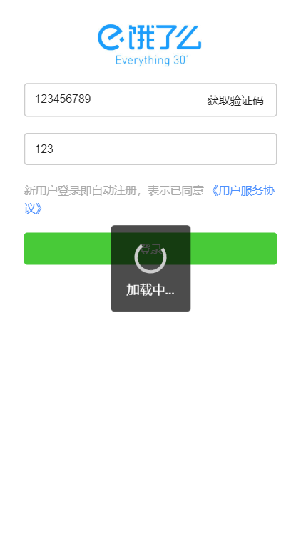
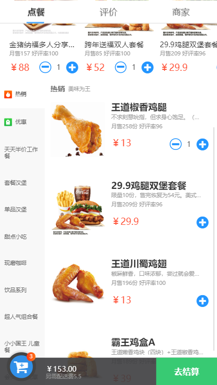
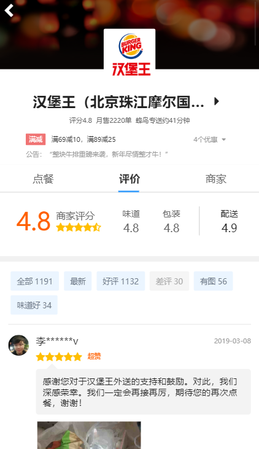
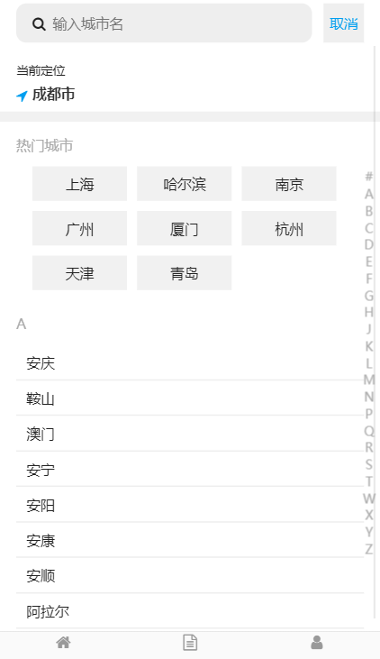

# ele-app

## 基于vue cli3 创建的仿饿了么前端项目

1. 项目配置

> * 默认配置 vue全家桶（vue2.6/vuex/vue-router）
> * 异步请求 axios
> * 滑动 better-scroll
> * UI库 Mint UI
> * 字体 Font Awesome
> * 高德地图定位，获取位置信息
> * 聚合短信验证码API
> * 解析post请求 qs

2. 本地安装调试
   
   `npm install`

   `npm run serve`

1. 上线部署

   `npm run build`

> 上线部署前，将vue.config.js中的跨域请求部分注释掉，改为在main.js中开启qs，因为后端接口已经设置为允许所有访问。

示例：

